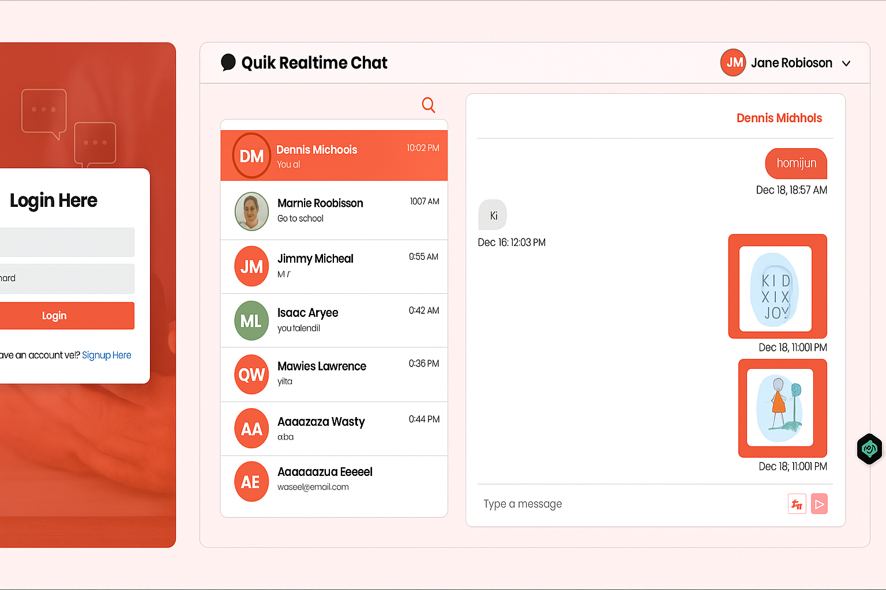

# Client README (Real-Time Chat Application)

## Features

- Real-time messaging with Socket.IO
- User authentication (Signup/Login)
- Online user status tracking
- Typing indicators
- Image sharing in chats
- Responsive UI
- Unread message counters
- User profile management
- Search functionality for users/chats

## Installation

1. Clone the repository

```bash
git clone https://github.com/yourusername/Real-Time-Chat-MERN-Project.git
cd client
```

2. Install dependencies

```bash
npm install
```

3. Create `.env` file

```env
VITE_REACT_SERVER_BASE_URL=http://localhost:4292
```

4. Start development server

```bash
npm run dev
```

## Available Scripts

- `npm run dev` - Start development server
- `npm run build` - Create production build
- `npm run lint` - Run ESLint
- `npm run preview` - Preview production build

## Environment Variables

| Variable Name                | Description        | Example                 |
| ---------------------------- | ------------------ | ----------------------- |
| `VITE_REACT_SERVER_BASE_URL` | Backend server URL | `http://localhost:4292` |

## Technologies Used

- React
- Redux Toolkit
- Socket.IO Client
- Axios
- Vite
- React Router
- Moment.js
- Emoji Picker
- React Hot Toast

# Server README (Real-Time Chat Backend)

## Features

- REST API endpoints
- JWT Authentication
- WebSocket support with Socket.IO
- MongoDB data storage
- Image upload to Cloudinary
- Error handling middleware
- CORS configuration
- Rate limiting
- API documentation

## Installation

1. Clone the repository

```bash
git clone https://github.com/yourusername/Real-Time-Chat-MERN-Project.git
cd server
```

2. Install dependencies

```bash
npm install
```

3. Create `config.env` file

```env
PORT=4292
MONGODB_URI=mongodb://localhost:27017/chat-app
JWT_SECRET=your_jwt_secret
JWT_EXPIRES_IN=90d
CLOUDINARY_CLOUD_NAME=your_cloud_name
CLOUDINARY_API_KEY=your_api_key
CLOUDINARY_API_SECRET=your_api_secret
CLIENT_BASE_URL=http://localhost:3000
```

4. Start server

```bash
node server.js
```

## API Endpoints

| Method | Endpoint                                   | Description       |
| ------ | ------------------------------------------ | ----------------- |
| POST   | `/api/v1/auth/signup`                      | User registration |
| POST   | `/api/v1/auth/login`                       | User login        |
| GET    | `/api/v1/user/get-all-users`               | Get all users     |
| POST   | `/api/v1/chat/create-new-chat`             | Create new chat   |
| GET    | `/api/v1/message/get-all-messages/:chatId` | Get chat messages |

## Environment Variables

| Variable Name     | Description            | Example                 |
| ----------------- | ---------------------- | ----------------------- |
| `PORT`            | Server port            | `4292`                  |
| `MONGODB_URI`     | MongoDB connection URI | `mongodb+srv://...`     |
| `JWT_SECRET`      | JWT encryption secret  | `secret123`             |
| `CLOUDINARY_*`    | Cloudinary config      | -                       |
| `CLIENT_BASE_URL` | Client application URL | `http://localhost:3000` |

## Deployment

1. Create production build

```bash
npm install --production
```

2. Start server

```bash
node server.js
```

Recommended deployment platforms:

- Render
- Heroku
- AWS EC2

## Technologies Used

- Node.js
- Express
- MongoDB/Mongoose
- Socket.IO
- JSON Web Tokens (JWT)
- Cloudinary
- CORS
- Dotenv

---

**Important Notes:**

1. Make sure MongoDB is running locally or provide a remote connection string
2. The server must be running before starting the client
3. For production, configure proper CORS origins and HTTPS
4. WebSocket URL should match the server URL (ws:// for HTTP, wss:// for HTTPS)

## Image

Here is an expected gif/photos of the preview of the App(Quik - Realtime Chat App)

## 
